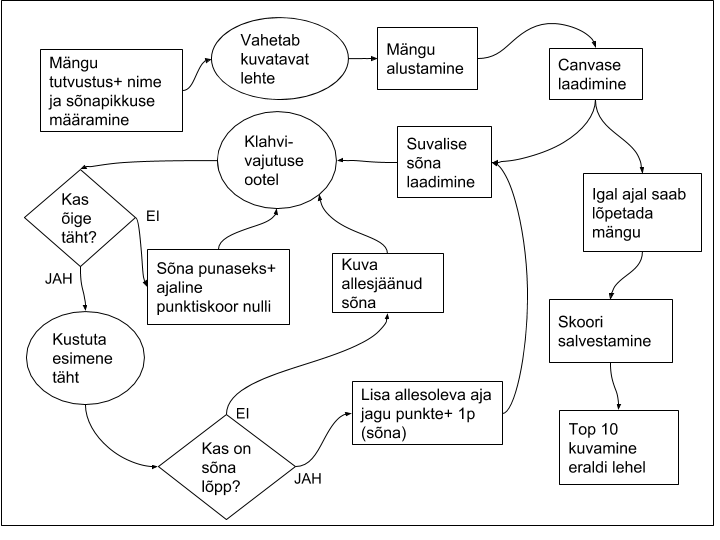

# 2. kodutöö – kirjutamise mängu täiendamine

## Autorid:
Grete Ojavere

Julika Maiste

## Mängu kirjeldus:

Eesmärk on võimalikult kiiresti ekraanile tekkivaid sõnu ära trükkida. 
Sõnad on võetud [Eesti Keele Instituudi lehelt](http://www.eki.ee/tarkvara/wordlist/) – [lemmad2013](http://www.eki.ee/tarkvara/wordlist/lemmad2013.txt). 

##Skoori arvutamise kirjeldus:

Iga sõna trükkimiseks on aega 10 sekundit. Punkte saab vastavalt allesjäänud ajale sel hetkel, kui viimane täht saab õigesti kirjutatud. Lisaks 1 punkt iga õigesti kirjutatud sõna eest. Vale tähe trükkimisel sekundipunktide skoor läheb tagasi nulli ja algab otsast peale. Õigesti kirjutatud sõnade punktid jäävad mängu lõpuni alles.

## Rakenduse tööprotsessi skeem:

  

## Täiendavad funktsionaalsused:  
    * eraldi on mängu tutvustav leht, kus kirjeldatakse mängu, saab sisestada mängija nime, valida esimese sõna pikkust ning alustada mängu; 
    * mängijate kohta hoitakse meeles ja salvestakse skoor; 
    * eraldi näidatakse välja 10 parima mängija skoori; 
    * valesti tähe trükkimine muudab skoori ja tekst muutub punaseks;
    * kasutaja saab ise valida raskusastme sõnapikkuse järgi;

